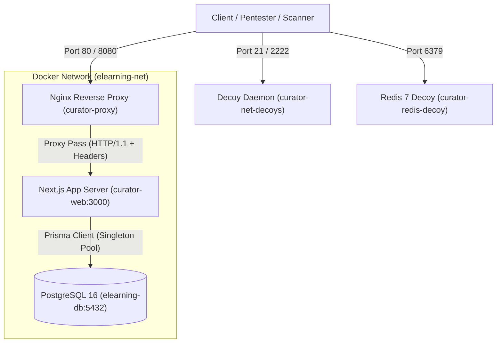

# 🏛️ Tài Liệu Kiến Trúc Kỹ Thuật & Cấu Hình Môi Trường Enterprise Lab

## 1. Tổng Quan Kiến Trúc Đa Tầng (Multi-Tier Architecture)

Nền tảng **The Academic Curator** được xây dựng theo mô hình kiến trúc phân lớp doanh nghiệp kết hợp giữa Next.js 15 App Router, React 19 Server Components (RSC) và Nginx Reverse Proxy:

---

## 2. Chi Tiết Các Tầng Hệ Thống

### 2.1. Tầng Cổng Vào (Gateway & Reverse Proxy Tier)
- **Công nghệ**: Nginx 1.24 Alpine ([`docker/nginx/nginx.conf`](../docker/nginx/nginx.conf)).
- **Cổng lắng nghe**:
  - **Port 80**: Proxy chuyển tiếp lưu lượng vào ứng dụng chính Next.js (`web:3000`), giữ nguyên các headers đặc thù của Next.js (`Next-Action`, `RSC`, `Next-Router-State-Tree`, `Next-Url`).
  - **Port 8080**: Endpoint ngụy trang (Decoy) mô phỏng Spring Boot Actuator Microservice (`/actuator/health`, `/actuator/info`, `/actuator/env` 401, `/api/internal/` 403).
- **Trang lỗi Gateway**: Trang lỗi 502/503/504 chuẩn Enterprise Gateway ([`docker/nginx/error_pages/50x.html`](../docker/nginx/error_pages/50x.html)).

### 2.2. Tầng Ngụy Trang & Bẫy Dò Quét (Decoys & Rabbit Holes)
- **FTP Decoy (Port 21)**: Chạy tiến trình Python độc lập mô phỏng banner `vsFTPd 3.0.5` và từ chối xác thực Anonymous ([`docker/decoys/ftp_decoy.py`](../docker/decoys/ftp_decoy.py)).
- **SSH Decoy (Port 2222)**: Mô phỏng banner `OpenSSH 8.9p1 Ubuntu` và chỉ chấp nhận khóa công khai (Publickey only) ([`docker/decoys/ssh_decoy.py`](../docker/decoys/ssh_decoy.py)).
- **Redis Decoy (Port 6379)**: Chạy `redis:7-alpine` với tham số `--requirepass`, yêu cầu mật khẩu (`NOAUTH`) khi truy vấn.

### 2.3. Tầng Ứng Dụng (Application Tier)
- **Framework**: Next.js 15.0.3 kết hợp React 19.0.0-rc-66855b96.
- **Quản lý phiên**: NextAuth.js v5 (Auth.js beta) với JWT mã hóa JWE.
- **Server Actions**: Các hàm xử lý backend RPC được định nghĩa tại [`lib/actions/`](../lib/actions/).

### 2.4. Tầng Dữ Liệu & Singleton Connection Pool
- **Cơ sở dữ liệu**: PostgreSQL 16 Alpine trong container `elearning-db`.
- **Singleton Prisma Client**: [`lib/prisma.ts`](../lib/prisma.ts) duy trì một thể hiện `Pool` và `PrismaClient` duy nhất trên toàn bộ tiến trình Node.js:
  - `max`: 20 kết nối.
  - `idleTimeoutMillis`: 30000 ms.
  - `connectionTimeoutMillis`: 5000 ms.

---

## 3. Chỉ Mục Reconnaissance & Camouflage

Hệ thống cung cấp sẵn các tệp chỉ mục chuẩn RFC phục vụ bài thực hành Reconnaissance:
- **`robots.txt`**: [`public/robots.txt`](../public/robots.txt)
- **`.well-known/security.txt`**: [`public/.well-known/security.txt`](../public/.well-known/security.txt) (RFC 9116)
- **`sitemap.xml`**: [`public/sitemap.xml`](../public/sitemap.xml)
- **API 404 Handler**: [`app/api/[...catchall]/route.ts`](../app/api/%5B...catchall%5D/route.ts)
